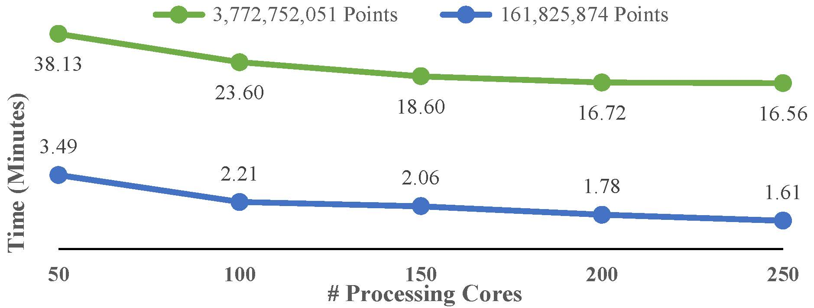
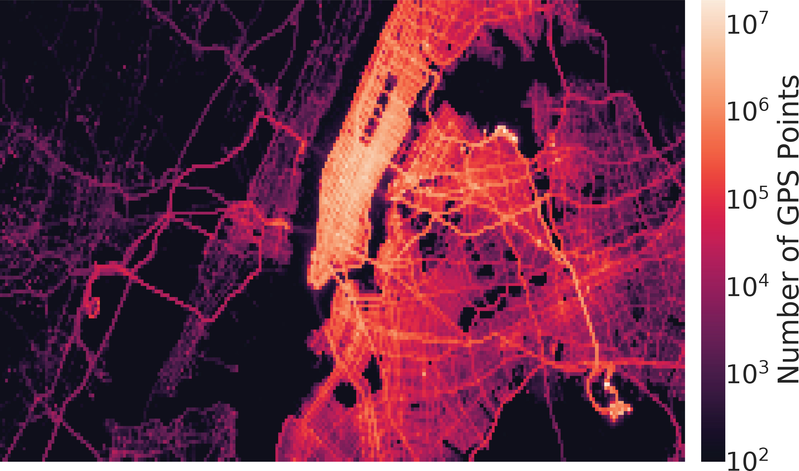

# GeoMatch

  <table width="100%" border="0" cellspacing="0" cellpadding="0">
    <tbody>
      <tr>
        <td width="400" valign="top">
        </td>
        <td>
          

            
             
            
              <strong>Distribution of 3.77 billion GPS taxi trajectories.</strong>
</td></tr></tbody></table>

GeoMatch is a novel, scalable, and efficient big-data pipeline for large-scale map-matching on Apache Spark. GeoMatch improves existing spatial big data solutions by utilizing a novel spatial partitioning scheme inspired by Hilbert space-filling curves. Thanks to its partitioning scheme, GeoMatch can effectively balance operations across different processing units and achieves significant performance gains. GeoMatch also incorporates a dynamically adjustable error correction technique that provides robustness against positioning errors. We evaluate GeoMatch through rigorous and extensive benchmarks that consider datasets containing large-scale urban spatial data sets ranging from 166,253 to 3.78 billion location measurements. Experimental results show up to 27.25-fold performance improvements compared to previous works while achieving better processing accuracy than current solutions as compared to the baseline methods (99.99%).

## License
GeoMatch is provided as-is under the BSD 3-clause license (https://github.com/bdilab/GeoMatch/blob/master/LICENSE), Copyright Ⓒ 2019, the City University of New York and University of Helsinki.

## Supported Spatial Objects
Currently, GeoMatch supports the following spatial objects.
<ul>
  <li>GMPoint</li>
  <li>GMLineString</li>
  <li>GMPolygon</li>
  <li>GMRectangle</li>
</ul>

New objects can be easily added by extending the class GMGeomBase and overriding the following methods.

<ul>
  <li>toJTS: <emph>Returns a JTS representation of the spatial objects. This method is used for distance computation by GeoMatch. In some cases a single object maybe transformed into multiple JTS objects for imporved accuracy as shown in GMLineString.scala</emph></li>
  <li>getHilbertIndexList: <emph>The method returns a list of Hilbert Indexes that the object passes through. The implementation is object-dependent. For instance, LineString object utilize a Line Rasterization Algorithms to determine which indexes the segments pass through</emph></li>
</ul>

## Working with GeoMatch

### Dependencies
<ul>
  <li>Apache Spark 2.4.0</li>
  <li>Scala 2.11</li>
  <li>Java 1.8</li>
  <li>Locationtech JTS 1.16.1</li>
</ul>

### Building GeoMatch
<pre>
cd Common
mvn compile install
cd ../GeoMatch
mvn compile install
</pre>

### Modifying GeoMatch
GeoMatch works on top of Apache Spark and does not modify its core. The source files can be imported as Maven projects into an IDE like IntelliJ or Eclipse with the Scala plugin installed. After modification, save the files and build the new sources as described earlier in the [Build](https://github.com/azeidan/TBD/blob/master/README.md#building-geomatch) subsection.

## Spatial Join kNN
The following is a sample code that shows how GeoMatch can be used to perform map-matching of tow datasets. The example uses the two synthetic datasets in the folder SampleCSV (firstDataset.csv and secondDataset.csv), but the code can be modified to use any other datasets as long as GeoMatch is provided with RDDs that contain the proper objects (i.e. objects that derived from GMGeomBase).

### 1. Spark context setup
This is a standard SparkContext initiliazation step including configuring Spark to use KryoSerializer. Skipping KryoSerializer may increase the processing time.
</indent>
<pre><code>val sparkConf = new SparkConf()
  .setAppName("GeoMatch_Test")
  .set("spark.serializer", classOf[KryoSerializer].getName)
  .registerKryoClasses(GeoMatch.getGeoMatchClasses())

// assuming local run
sparkConf.setMaster("local[*]")

val sparkContext = new SparkContext(sparkConf)</code></pre>

### 2. Creating the Spark RDDs
In this step, we parse the input file and create an RDD of spatial objects. The process is performed in parallel; for performance gains, the largest dataset should be the second dataset. The results of the match operation is <emph>ALL</emph> objects from the <emph>second</emph> dataset with a list of matches from the first dataset. 
</indent>
<pre><code>// The first dataset.
val rddFirstSet = sparkContext.textFile("firstDataset.csv")
                        .mapPartitions(_.map(line => {

                            // parse the line and form the spatial object
                            val parts = line.split(',')

                            val arrCoords = parts.slice(1, parts.length)
                                .map(xyStr => {
                                    val xy = xyStr.split(' ')

                                    (xy(0).toDouble.toInt, xy(1).toDouble.toInt)
                                })

                            // create the spatial object GMLineString. The first parameter is the payload
                            // the second parameter is the list of coordinates that form the LineString
                            new GMLineString(parts(0), arrCoords)
                        }))

// The second dataset.
val rddSecondSet = sparkContext.textFile("secondDataset.csv")
                         .mapPartitions(_.map(line => {

                             // parse the line and form the spatial object
                             val parts = line.split(',')

                             // create the spatial object GMPoint. The first parameter is the payload
                             // the second parameter is the point's coordinates
                             new GMPoint(parts(0), (parts(1).toDouble.toInt, parts(2).toDouble.toInt))
                         }))</code></pre>
### 3. Initializing GeoMatch
In this step, GeoMatch is initialized using parameters shown below:

<pre><code>val geoMatch = new GeoMatch(false, 256, 150, (-1, -1, -1, -1))</code></pre>

<table style="margin-left: auto; margin-right: auto; border: 2px solid #000072;" border="1" cellspacing="0" cellpadding="0">
  <tbody>
    <tr>
      <td style="text-align: center;" width="170"><strong>Parameter</strong></td>
      <td style="text-align: center;" width="115"><strong>Default Value</strong></td>
      <td style="text-align: center;" width="190"><strong>Description</strong></td>
    </tr>
    <tr>
      <td>outputDebugMessages</td>
      <td>false</td>
      <td>Set to true to receive output debug messages</td>
    </tr>
    <tr>
      <td>hilbertN</td>
      <td>256</td>
      <td>The size of the Hilbert Space-Filling Curve. If set to a higher number, precision is increased while increasing the processing time.</td>
    </tr>
    <tr>
      <td>errorRangeBy</td>
      <td>150</td>
      <td>
        
The maximum distance for accepted matches. After this distance, the match is rejected. This value is used to find matches within a specific distance and can be used to account for GPS errors.

      </td>
    </tr>
    <tr>
      <td>searchGridMBR</td>
      <td>(-1,&nbsp;-1,&nbsp;-1,&nbsp;-1)</td>
      <td>
        

          
The search Grid MBR. If the default value is provided, GeoMatch

          
will compute it from Dataset1. This option can be used to prune the dataset's and exclude out-of-range objects.

        

      </td>
    </tr>
  </tbody>
</table>

### 4. Map-matching
In this step, we invoke GeoMatch's join operations. Currently, three operations are supported with the last two in the experimental phase.
<ul>
  <li>spatialJoinKNN</li>
  <li>spatialJoinRange</li>
  <li>spatialJoinDistance</li>
</ul>

<pre><code>val resultRDD = geoMatch.spatialJoinKNN(rddFirstSet, rddSecondSet, 3, false)</code></pre>

### 5. Processing Results
Finally, the results can be obtained by invoking one of the standard Spark actions. The following line will simply print the point's payload followed by the payload values of all matched LineString objects.

<pre><code>resultRDD.mapPartitions(_.map(row => println("%-10s%s".format(row._1.payload, row._2.map(_.payload).mkString(",")))))
         .collect()</code></pre>

Copyright &#9400; 2019, the City University of New York and University of Helsinki. All rights reserved.
